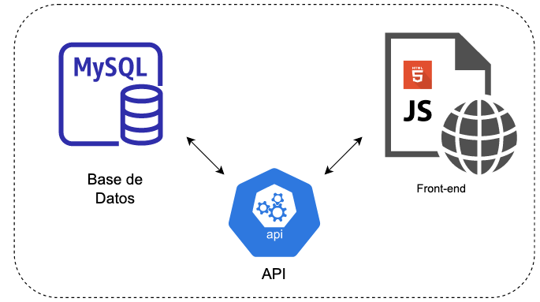

# desafío BSALE

## Descripción general

El desafío consiste en construir una tienda online que muestre los productos por categoria mediante consultas a una base de datos. La aplicación debe contar con un buscador el cual debe estar implementado a nivel de back-end. El front-end debe ser construido sin ningún framework.

La pagina web puede encontrarse en: [https://front-bsale-jm.herokuapp.com/](https://front-bsale-jm.herokuapp.com/)

## Estructura

La aplicación consiste en un componente *front-end* y un *API*. El *front-end* permite al usuario observar y navegar entre los diferentes productos. Ademas, permite añadir los productos a un carro de compras y modificar sus cantidades. El *API* que permite realizar consulta a la base de datos y entregarlas al cliente. La base de datos tiene un motor MySQL y contiene dos tablas. Una tabla con información de productos y otra con información de las categorias.



### Front-end

El fron-end esta construida en **HTML** y **Javascript**. Para el estilo se uso **Bootstrap**. La lógica de la aplicación esta escrita en puro javascript.  La información presentada es controlada mediante *eventos*. Dependiendo de donde el usuario haga click se desencadena un *fetch* al API. Luego se genera el HTML apropiado para la presentación de la información recibida. El código de Javascript, ademas de encargarse de realizar los *fetch* al API dependiendo de los eventos, tambien maneja la lógica de las siguientes funcionalidades:

- Paginación
- Añadir productos al carro de compras
- Eliminar productos al carro de compras
- Modificar cantidad de cierto producto en el carro de compras

### API

Implementado en **Python** con la liberia **Flask**. Para conectarse a la base de datos se usó el conector de Python para MySQL `mysql-connector-python`. Para realizar las consultas se uso `pandas` para evitar un paso intermedio de construir un `dict` con la información de las respuesta de la base de datos.

#### Productos por categoria y pagina
```
  [GET] /read?category_id=<CATEGORY_ID>&page=<PAGE>
  Content-Type: "application/json"
  PARAMS: None

  RESPONSE:

[
  { id: 5, name: 'ENERGETICA MR BIG', url_image:'https://dojiw2m9tvv09.cloudfront.net/11132/pro...', price:1490.0, discount:20, category:1 },
  { id: 6, name: 'ENERGETICA RED BULL', url_image:'https://dojiw2m9tvv09.cloudfront.net/11132/pro...', price:1490.0, discount:0, category:1 },
 { id: 7, name: 'ENERGETICA SCORE', url_image:'https://dojiw2m9tvv09.cloudfront.net/11132/pro...', price:1290.0, discount:0, category:1 },
 ...
]
```

#### Productos por nombre y/o descuento
```
  [GET] /filter?name=<NAME>&discount=<DISCOUNT>
  Content-Type: "application/json"
  PARAMS: None

  RESPONSE:

[
  { id: 5, name: 'ENERGETICA MR BIG', url_image:'https://dojiw2m9tvv09.cloudfront.net/11132/pro...', price:1490.0, discount:20, category:1 },
  { id: 6, name: 'ENERGETICA RED BULL', url_image:'https://dojiw2m9tvv09.cloudfront.net/11132/pro...', price:1490.0, discount:0, category:1 },
 { id: 7, name: 'ENERGETICA SCORE', url_image:'https://dojiw2m9tvv09.cloudfront.net/11132/pro...', price:1290.0, discount:0, category:1 },
 ...
]
```

#### Conteo del número de productos de cierta categoria
```
  [GET] /count?category_id=<CATEGORY_ID>
  Content-Type: "application/json"
  PARAMS: None

  RESPONSE:

[
  { cuenta: 5 }
]
```